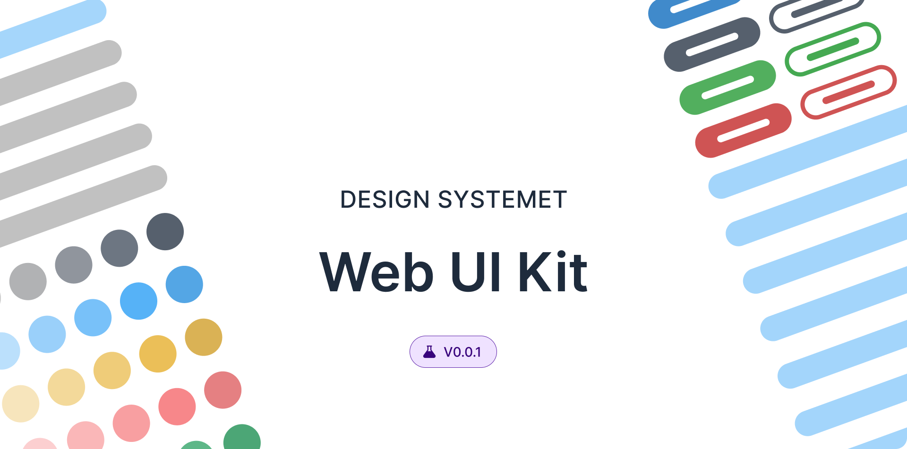

<!-- PROJECT LOGO -->
 

  

<h3 align="center">Sundae UI React</h3>

  

    Accessible, modular, and customizable React UI library
     
    <a href="https://github.com/donaldturinglee/sundaeui-react"><strong>Explore the docs »</strong></a>
     
     
    <a href="https://github.com/donaldturinglee/sundaeui-react">View Demo</a>
    ·
    <a href="https://github.com/donaldturinglee/sundaeui-react/issues/new?labels=bug&template=bug-report---.md">Report Bug</a>
    ·
    <a href="https://github.com/donaldturinglee/sundaeui-react/issues/new?labels=enhancement&template=feature-request---.md">Request Feature</a>
  

<!-- TABLE OF CONTENTS -->

  
Table of Contents

  <ol>
    <li>
      <a href="#about-the-project">About The Project</a>
      <ul>
        <li><a href="#built-with">Built With</a></li>
      </ul>
    </li>
    <li>
      <a href="#getting-started">Getting Started</a>
      <ul>
        <li><a href="#prerequisites">Prerequisites</a></li>
        <li><a href="#installation">Installation</a></li>
      </ul>
    </li>
    <li><a href="#usage">Usage</a></li>
    <li><a href="#contributing">Contributing</a></li>
    <li><a href="#license">License</a></li>
    <li><a href="#contact">Contact</a></li>
  </ol>

<!-- ABOUT THE PROJECT -->
## About The Project

TODO

### Features

TODO

(<a href="#readme-top">back to top</a>)

### Built With

[![React][React.js]][React-url]
[![TypeScript][TypeScript]][TypeScript-url]
[![Storybook][Storybook]][Storybook-url]
[![Rollup][Rollup]][Rollup-url]
[![Sass][Sass]][Sass-url]
[![Jest][Jest]][Jest-url]

(<a href="#readme-top">back to top</a>)

<!-- GETTING STARTED -->
## Getting Started

This is an example of how you may give instructions on setting up your project locally.
To get a local copy up and running follow these simple example steps.

### Prerequisites

TODO

## Installation

TODO

(<a href="#readme-top">back to top</a>)

<!-- USAGE EXAMPLES -->
## Usage

TODO

(<a href="#readme-top">back to top</a>)

<!-- CONTRIBUTING -->
## Contributing

Contributions are what make the open source community such an amazing place to learn, inspire, and create. Any contributions you make are **greatly appreciated**.

If you have a suggestion that would make this better, please fork the repo and create a pull request. You can also simply open an issue with the tag "enhancement".
Don't forget to give the project a star! Thanks again!

1. Fork the Project
2. Create your Feature Branch (`git checkout -b feature/AmazingFeature`)
3. Commit your Changes (`git commit -m 'feat: Add some AmazingFeature'`)
4. Push to the Branch (`git push origin feature/AmazingFeature`)
5. Open a Pull Request

(<a href="#readme-top">back to top</a>)

<!-- LICENSE -->
## License

Distributed under the MIT License. See `LICENSE` for more information.

(<a href="#readme-top">back to top</a>)

<!-- CONTACT -->
## Contact

Twitter - [@Donald Lee](https://twitter.com/donaldturinglee)

Project Link: [https://github.com/donaldturinglee/sundaeui-react](https://github.com/donaldturinglee/sundaeui-react)

(<a href="#readme-top">back to top</a>)

<!-- MARKDOWN LINKS & IMAGES -->
[React.js]: https://img.shields.io/badge/React-20232A?style=for-the-badge&logo=react&logoColor=61DAFB
[React-url]: https://react.dev/
[TypeScript]: https://img.shields.io/badge/TypeScript-3178C6?style=for-the-badge&logo=typescript&logoColor=white
[TypeScript-url]: https://www.typescriptlang.org/
[Storybook]: https://img.shields.io/badge/Storybook-FF4785?style=for-the-badge&logo=storybook&logoColor=white
[Storybook-url]: https://storybook.js.org/
[Rollup]: https://img.shields.io/badge/Rollup-EC4A3F?style=for-the-badge&logo=rollup.js&logoColor=white
[Rollup-url]: https://rollupjs.org/
[Sass]: https://img.shields.io/badge/Sass-CC6699?style=for-the-badge&logo=sass&logoColor=white
[Sass-url]: https://sass-lang.com/
[Jest]: https://img.shields.io/badge/Jest-C21325?style=for-the-badge&logo=jest&logoColor=white
[Jest-url]: https://jestjs.io/
